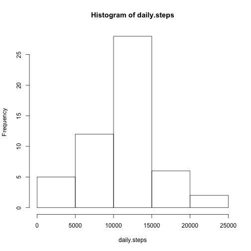
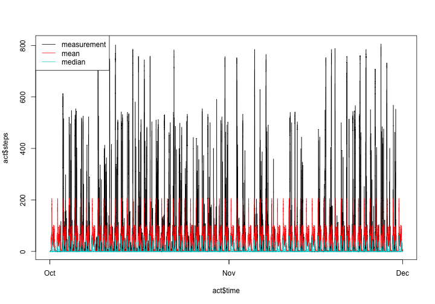
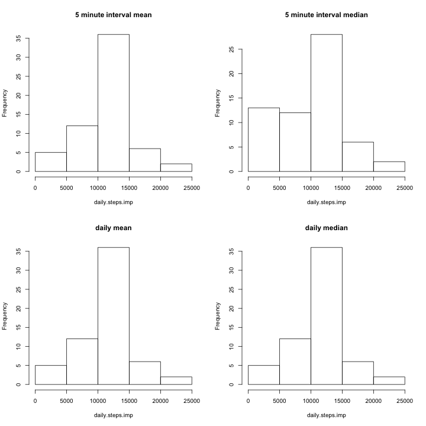
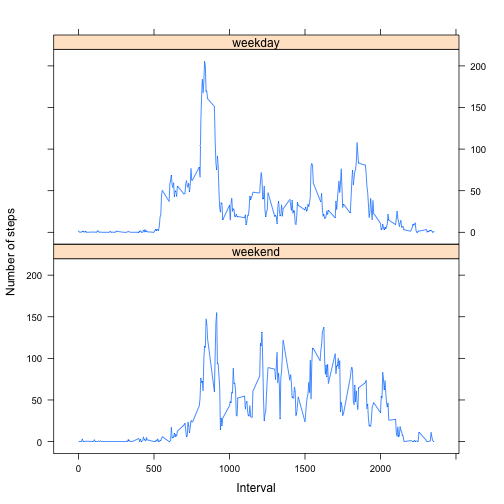

## Loading and preprocessing the data

Read data from the zip archive, store in data frame __act__:

```r
act <- read.csv(unz("activity.zip","activity.csv"), stringsAsFactors=FALSE)
```

Create two new columns in data frame __act__:
- __hm__ - hour and minutes formatted as hh:mm
- __time__ - date/time as a POSIXlt class


```r
act$hm <- gsub("(..$)",":\\1",sprintf("%04d",act$interval))
act$time <- strptime(paste(act$date,act$hm),format="%Y-%m-%d %H:%M")
```

The first few rows of the __act__ data frame look like this:

```
##   steps       date interval    hm                time
## 1    NA 2012-10-01        0 00:00 2012-10-01 00:00:00
## 2    NA 2012-10-01        5 00:05 2012-10-01 00:05:00
## 3    NA 2012-10-01       10 00:10 2012-10-01 00:10:00
## 4    NA 2012-10-01       15 00:15 2012-10-01 00:15:00
## 5    NA 2012-10-01       20 00:20 2012-10-01 00:20:00
## 6    NA 2012-10-01       25 00:25 2012-10-01 00:25:00
```


## What is mean total number of steps taken per day?


```r
daily.steps <- tapply(act$steps,act$date,sum)
hist(daily.steps)
```

 

```r
daily.steps.mean <- as.integer(mean(daily.steps,na.rm=TRUE))
daily.steps.median <- as.integer(median(daily.steps,na.rm=TRUE))
```

The mean number of steps per day is 10766, and the
median is 10765.


## What is the average daily activity pattern?

Compute the mean across all days for each 5 minute interval:

```r
fivemin.tmp <- tapply(act$steps,act$interval,mean,na.rm=TRUE)
fivemin.mean <- data.frame(interval = as.integer(names(fivemin.tmp)),
    steps.mean<-fivemin.tmp)
act <- merge(act,fivemin.mean,by="interval")
```

Find the index that has the highest mean:

```r
i.max.mean <- which(fivemin.mean$steps.mean == max(fivemin.mean$steps.mean))
```

Compute the median across all days for each 5 minute interval:

```r
fivemin.tmp <- tapply(act$steps,act$interval,median,na.rm=TRUE)
fivemin.median <- data.frame(interval = as.integer(names(fivemin.tmp)),
    steps.median=fivemin.tmp)
act <- merge(act,fivemin.median,by="interval")
```

Find the index that has the highest median:

```r
i.max.median <- which(fivemin.median$steps.median ==
    max(fivemin.median$steps.median))
```

Make the plot:

```r
act <- act[order(act$time),]

plot(act$time,act$steps,type="l")
lines(act$time,act$steps.mean,col="red")
lines(act$time,act$steps.median,col="cyan3")
legend("topleft",legend=c("measurement","mean","median"),lty=1,
       col=c("black","red","cyan3"))
```

 

For the maximum values of mean and median, make a string that gives the interval, and store the number of steps:

```r
interval.max.mean <- gsub("(..$)",":\\1",sprintf("%04d",
    fivemin.mean$interval[i.max.mean]))
steps.max.mean <- as.integer(fivemin.mean$steps.mean[i.max.mean])
interval.max.median <- gsub("(..$)",":\\1",sprintf("%04d",
    fivemin.median$interval[i.max.median]))
steps.max.median <- as.integer(fivemin.median$steps.median[i.max.median])
```

#### Highest mean and median:
The 5 minute interval with the highest mean number of steps is
08:35, with 206 steps. The interval with
the highest median is 08:45, with 60 steps.


## Imputing missing values

#### Number of missing values:


```r
na.cnt <- sum(is.na(act$steps))
```
The total number of missing step values in the activity dataset is
2304.

#### Imputation:

Make list of 4 data frames that have the `steps` variable imputed in different ways:
- __act.imp[[1]]__: mean number of steps in the corresponding 5 minute interval across all days
- __act.imp[[2]]__: median number of steps in the corresponding 5 minute interval across all days
- __act.imp[[3]]__: mean number of steps per day divided equally over all 5 minute intervals
- __act.imp[[4]]__: median number of steps per day divided equally over all 5 minute intervals


```r
imp.method <- c(
    "5 minute interval mean",
    "5 minute interval median",
    "daily mean",
    "daily median"
    )
act.imp <- list()
for (i in 1:length(imp.method)) {
    act.imp[[i]] <- list(method=imp.method[i],act=act)
}
act.imp[[1]]$act$steps[is.na(act.imp[[1]]$act$steps)] <-
    act.imp[[1]]$act$steps.mean[is.na(act.imp[[1]]$act$steps)]
act.imp[[2]]$act$steps[is.na(act.imp[[2]]$act$steps)] <-
    act.imp[[2]]$act$steps.median[is.na(act.imp[[2]]$act$steps)]
act.imp[[3]]$act$steps[is.na(act.imp[[3]]$act$steps)] <-
    daily.steps.mean/24/60*5
act.imp[[4]]$act$steps[is.na(act.imp[[4]]$act$steps)] <-
    daily.steps.median/24/60*5
```

Table of imputation results is in __imp.df__.


```r
imp.df <- data.frame(imp.method=c("not imputed",imp.method),
    daily.mean=NA,daily.median=NA,
    delta.mean=NA,delta.median=NA)
imp.df[1,2:3] <- c(daily.steps.mean,daily.steps.median)
par(mfrow=c(2,2))
for (i in 1:length(act.imp)) {
    daily.steps.imp <- with(act.imp[[i]]$act,tapply(steps,date,sum))
    hist(daily.steps.imp,main=act.imp[[i]]$method)
    imp.df[i+1,2] <- as.integer(mean(daily.steps.imp,na.rm=TRUE))
    imp.df[i+1,3] <- as.integer(median(daily.steps.imp,na.rm=TRUE))
    imp.df[i+1,4] <- imp.df[i+1,2] - imp.df[1,2]
    imp.df[i+1,5] <- imp.df[i+1,3] - imp.df[1,3]
}
```

 

#### Summary of imputation:


```r
library(xtable)
print(xtable(imp.df), type="html")
```

<!-- html table generated in R 3.1.2 by xtable 1.7-4 package -->
<!-- Tue Feb  3 14:41:30 2015 -->
<table border=1>
<tr> <th>  </th> <th> imp.method </th> <th> daily.mean </th> <th> daily.median </th> <th> delta.mean </th> <th> delta.median </th>  </tr>
  <tr> <td align="right"> 1 </td> <td> not imputed </td> <td align="right"> 10766 </td> <td align="right"> 10765 </td> <td align="right">  </td> <td align="right">  </td> </tr>
  <tr> <td align="right"> 2 </td> <td> 5 minute interval mean </td> <td align="right"> 10766 </td> <td align="right"> 10766 </td> <td align="right">   0 </td> <td align="right">   1 </td> </tr>
  <tr> <td align="right"> 3 </td> <td> 5 minute interval median </td> <td align="right"> 9503 </td> <td align="right"> 10395 </td> <td align="right"> -1263 </td> <td align="right"> -370 </td> </tr>
  <tr> <td align="right"> 4 </td> <td> daily mean </td> <td align="right"> 10766 </td> <td align="right"> 10766 </td> <td align="right">   0 </td> <td align="right">   1 </td> </tr>
  <tr> <td align="right"> 5 </td> <td> daily median </td> <td align="right"> 10766 </td> <td align="right"> 10765 </td> <td align="right">   0 </td> <td align="right">   0 </td> </tr>
   </table>

Imputation with the mean works well (zero delta) in both cases when the imputed values are granular at the 5 minute interval level, or when they are aggregated to daily values.

Imputation with the median gives wrong results when the imputation is done at the 5 minute interval level, but gives perfect matches for both means and medians when the imputation is done with daily values. The lesson is that imputation with the median should be done at the same aggregation level as the analysis. When done correctly, it is the best solution.


## Are there differences in activity patterns between weekdays and weekends?

Make data frame __fivemin.mean.bytype__ that contains means by interval for weekdays and weekends. Use data imputed with medians by 5 minutes interval. This is OK, because the analsyis is done at the same level, without further aggregation:


```r
act.work <- act.imp[[2]]$act
daytype <- factor(weekdays(act.work$time) %in% c("Saturday","Sunday"),
    levels=c(TRUE,FALSE),labels=c("weekend","weekday"))
fivemin.mean.bytype <- tapply(act.work$steps,
    list(interval=act.work$interval,daytype=daytype),mean,na.rm=TRUE)
```

Reshape the data into "tall" format:


```r
library(reshape2)
fivemin.mean.bytype.tall <- melt(fivemin.mean.bytype, id.vars="interval")
```

Make the plot using the `lattice` package:


```r
library(lattice)
xyplot(value ~ interval | daytype, fivemin.mean.bytype.tall,
       xlab="Interval",
       ylab="Number of steps",
       type="l",
       layout=c(1,2)
       )
```

 
